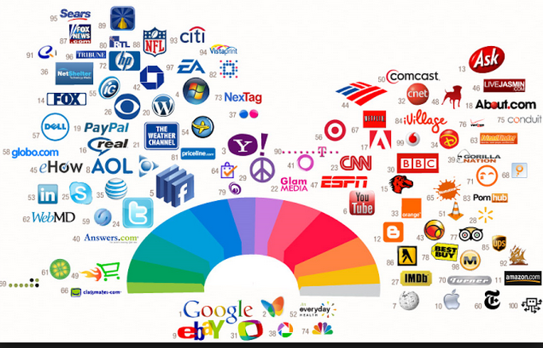
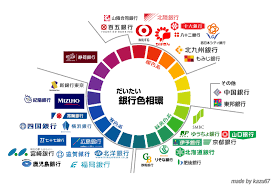
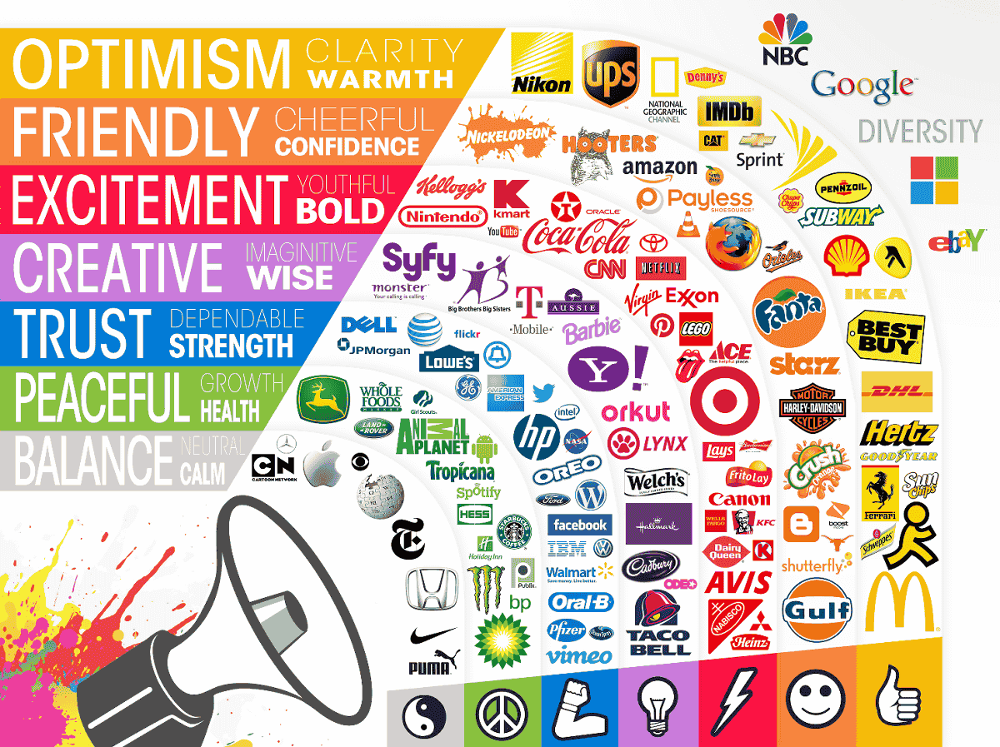
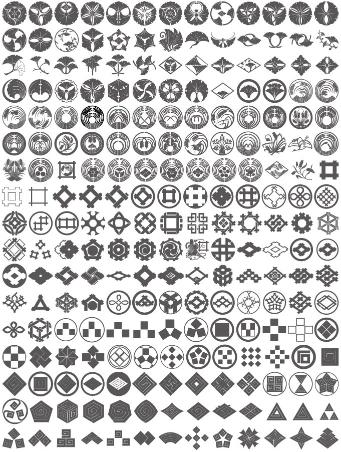
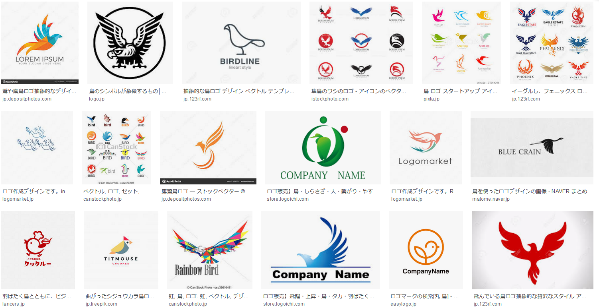
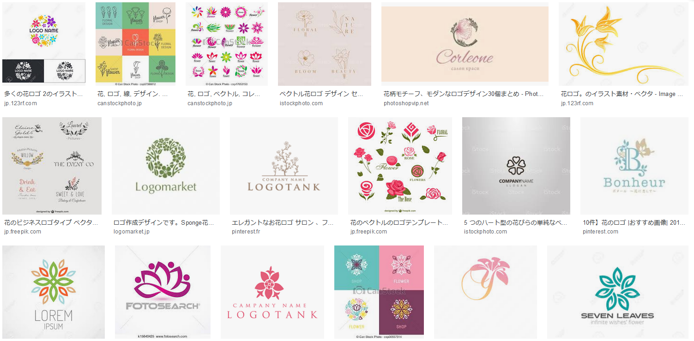
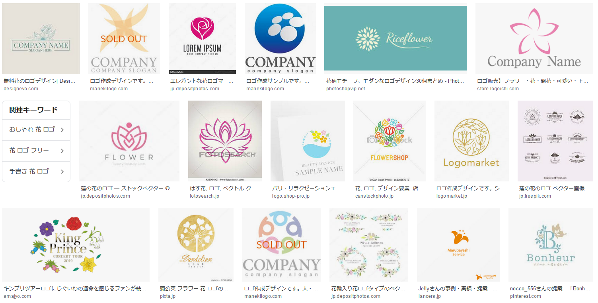
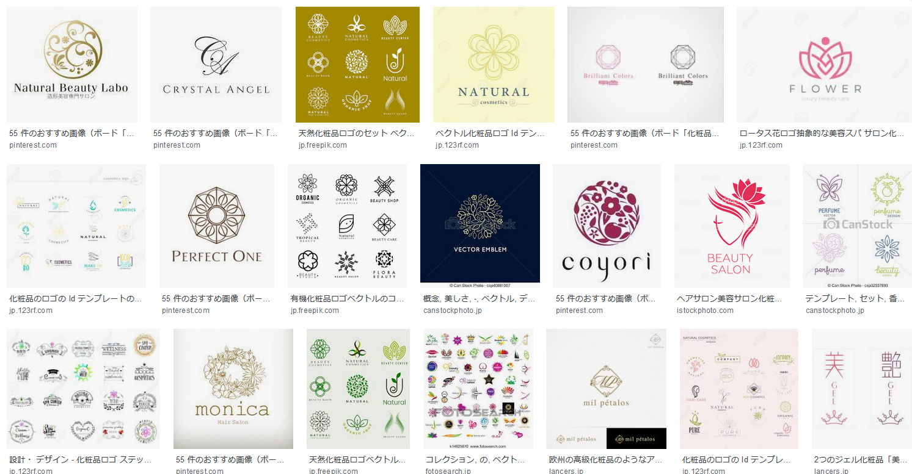
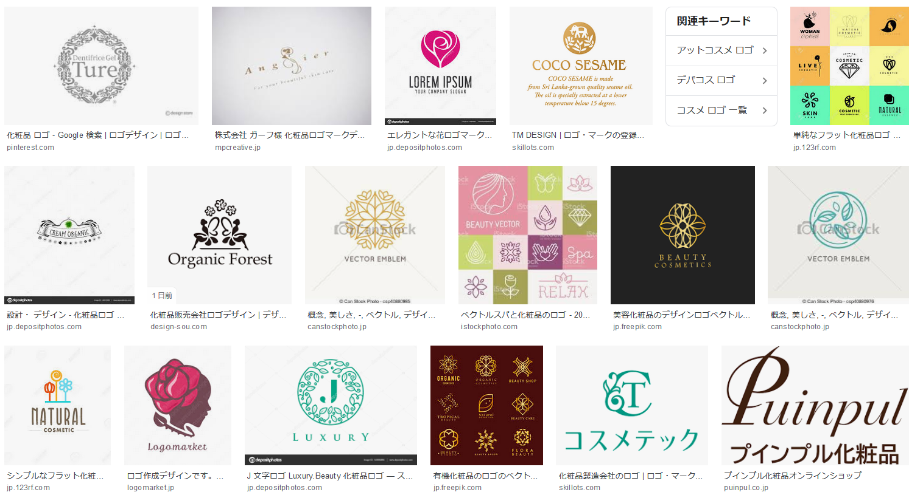

# 鳥

[鳥ロゴ](https://www.google.com/search?q=%E9%B3%A5%E3%80%80%E3%83%AD%E3%82%B4&safe=off&client=firefox-b-d&source=lnms&tbm=isch&sa=X&ved=0ahUKEwix29fwmZ_kAhUsxosBHcXRCpoQ_AUIESgB&biw=1417&bih=870)

# 花

[花ロゴ](https://www.google.com/search?q=%E8%8A%B1%E3%80%80%E3%83%AD%E3%82%B4&safe=off&client=firefox-b-d&source=lnms&tbm=isch&sa=X&ved=0ahUKEwi_w_7GpqLkAhWhxYsBHb7xACUQ_AUIESgB&biw=1417&bih=870)

## 都道府県

モノクロ以外もある → [都道府県 県章](https://ja.wikipedia.org/wiki/%E9%83%BD%E9%81%93%E5%BA%9C%E7%9C%8C%E7%AB%A0)

# 化粧品

[ → 化粧品](https://www.google.com/search?q=%E5%8C%96%E7%B2%A7%E5%93%81%E3%80%80%E3%83%AD%E3%82%B4&safe=off&client=firefox-b-d&source=lnms&tbm=isch&sa=X&ved=0ahUKEwik3bCtkKTkAhUyE6YKHWZ5D44Q_AUIESgB&biw=1417&bih=870)

