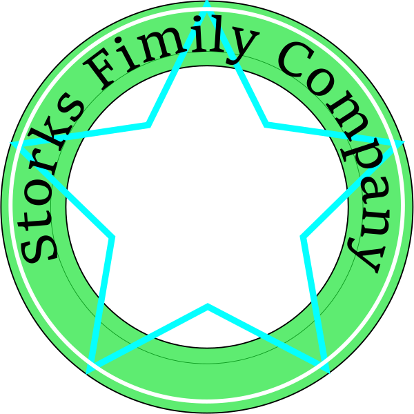

# 名称

|English|和名|画像検索リンク|備考|
|:--:|:--:|:--:|:--:|
|Storks|コウノトリ|[画像](https://www.google.com/search?q=%E3%82%B3%E3%82%A6%E3%83%8E%E3%83%88%E3%83%AA&safe=off&client=firefox-b-d&source=lnms&tbm=isch&sa=X&ved=0ahUKEwiK9vzN8J7kAhXGGaYKHaXnBR0Q_AUIEigC&biw=1432&bih=876)||
|Oaks|樫|[画像](https://www.google.com/search?q=%E6%A8%AB%E3%81%AE%E6%9C%A8&safe=off&source=lnms&tbm=isch&sa=X&ved=0ahUKEwjPvriF8Z7kAhUtGKYKHR0vBDcQ_AUIESgB&biw=1432&bih=876)||
|Willows|ヤナギ|[画像](https://www.google.com/search?q=%E3%83%A4%E3%83%8A%E3%82%AE&safe=off&client=firefox-b-d&source=lnms&tbm=isch&sa=X&ved=0ahUKEwiAgans8J7kAhUoE6YKHc0wBesQ_AUIESgB&biw=1432&bih=876)||
|Five-spots|花|[画像](https://www.google.com/search?q=Five+Spot&safe=off&client=firefox-b-d&source=lnms&tbm=isch&sa=X&ved=0ahUKEwitgqyM8Z7kAhWmyYsBHQz_AWsQ_AUIEigC&biw=1432&bih=876)||

## Five-Spots

[→ Five-Spots](https://www.google.com/search?safe=off&client=firefox-b-d&biw=1417&bih=870&tbm=isch&sa=1&ei=c3JlXeqLBMKUmAXs5rqgCA&q=FiveSpots+%E8%8A%B1&oq=FiveSpots+%E8%8A%B1&gs_l=img.3...187219.190606..190966...3.0..2.565.2838.3j4j0j2j2j1......0....1..gws-wiz-img.b_OMhcJLA4s&ved=0ahUKEwiqkfGs06PkAhVCCqYKHWyzDoQQ4dUDCAY&uact=5)

### 第一号

フォントがショボい、企業ロゴっぽさが低い

ありきたり、無名だとシンプルロゴは厳しいのかと考える 
変に奇をてらったものよりシンプルで良いという気もするが

ベクターソフト制作 このレベルのグラデーションは名刺では表現できない

## Willows

名刺の場合は真ん中にQRコードを入れるデザイン

ヤナギからのネコヤナギ 借り物イラスト製作途中 ペイントソフトの使い方を学ぶ必要性

こういう方向性があるという意味で

## Storks

ベクターソフトで完全自作1号

スタバのロゴを基本としつつ 
文字のパス配置・パスの排他結合によるドーナッツ形状・幾何学模様(星形)などの練習を兼ねて

真ん中にQRコード配置するとハデすぎる

ドミノピザ型 
このタイプのロゴに入れるには文字が多すぎる

## Oaks

樫の木1号、ラフ画、木製品扱ってるイメージ 
既にどっかがこんなロゴ使ってそうではあるがｗ

